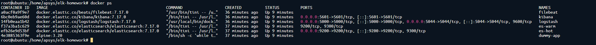
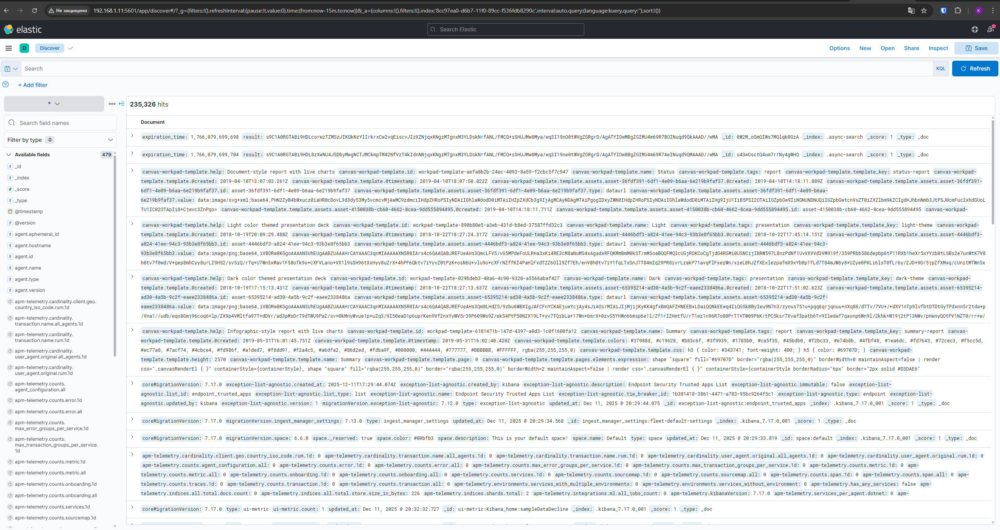
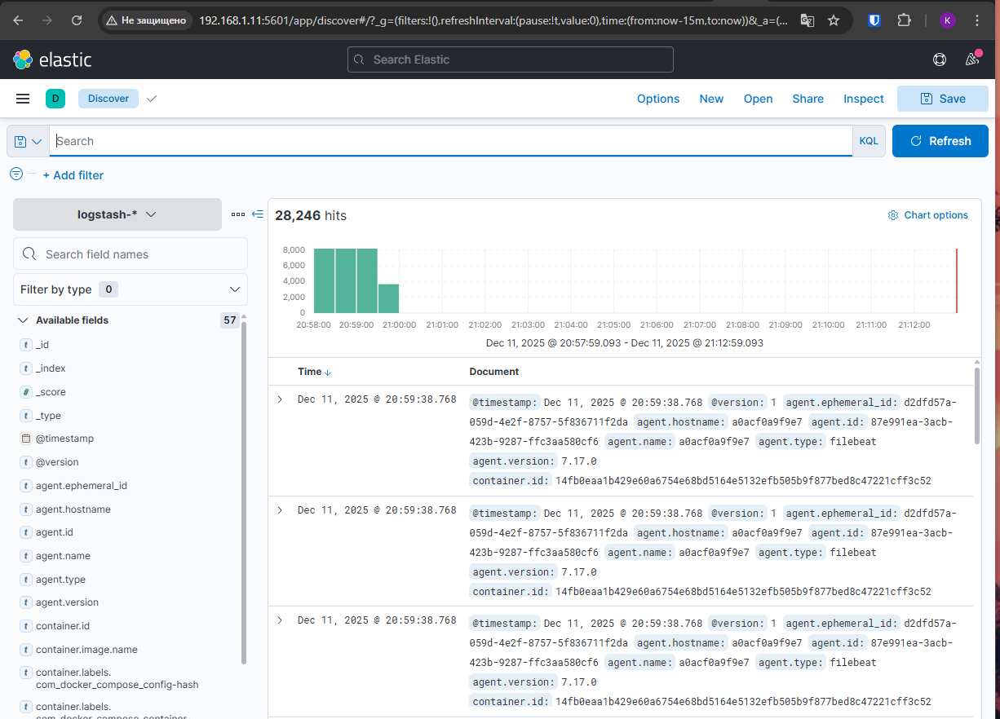

# Домашнее задание к занятию 15 «Система сбора логов Elastic Stack» - Крюков Егор

## Дополнительные ссылки

При выполнении задания используйте дополнительные ресурсы:

- [поднимаем elk в docker](https://www.elastic.co/guide/en/elastic-stack-get-started/current/get-started-docker.html);
- [поднимаем elk в docker с filebeat и docker-логами](https://www.sarulabs.com/post/5/2019-08-12/sending-docker-logs-to-elasticsearch-and-kibana-with-filebeat.html);
- [конфигурируем logstash](https://www.elastic.co/guide/en/logstash/current/configuration.html);
- [плагины filter для logstash](https://www.elastic.co/guide/en/logstash/current/filter-plugins.html);
- [конфигурируем filebeat](https://www.elastic.co/guide/en/beats/libbeat/5.3/config-file-format.html);
- [привязываем индексы из elastic в kibana](https://www.elastic.co/guide/en/kibana/current/index-patterns.html);
- [как просматривать логи в kibana](https://www.elastic.co/guide/en/kibana/current/discover.html);
- [решение ошибки increase vm.max_map_count elasticsearch](https://stackoverflow.com/questions/42889241/how-to-increase-vm-max-map-count).

В процессе выполнения в зависимости от системы могут также возникнуть не указанные здесь проблемы.

Используйте output stdout filebeat/kibana и api elasticsearch для изучения корня проблемы и её устранения.

## Задание повышенной сложности

Не используйте директорию [help](./help) при выполнении домашнего задания.

## Задание 1

Вам необходимо поднять в докере и связать между собой:

- elasticsearch (hot и warm ноды);
- logstash;
- kibana;
- filebeat.

Logstash следует сконфигурировать для приёма по tcp json-сообщений.

Filebeat следует сконфигурировать для отправки логов docker вашей системы в logstash.

В директории [help](./help) находится манифест docker-compose и конфигурации filebeat/logstash для быстрого 
выполнения этого задания.

Результатом выполнения задания должны быть:

- скриншот `docker ps` через 5 минут после старта всех контейнеров (их должно быть 5);
- скриншот интерфейса kibana;
- docker-compose манифест (если вы не использовали директорию help);
- ваши yml-конфигурации для стека (если вы не использовали директорию help).

## Ответ




***docker-compose.yml***
```
version: "3.8"

services:
  es-hot:
    image: docker.elastic.co/elasticsearch/elasticsearch:7.17.0
    container_name: es-hot
    environment:
      - node.name=es-hot
      - cluster.name=es-docker-cluster
      - discovery.seed_hosts=es-hot,es-warm
      - cluster.initial_master_nodes=es-hot,es-warm
      - node.attr.box_type=hot
      - bootstrap.memory_lock=true
      - "ES_JAVA_OPTS=-Xms512m -Xmx512m"
      - xpack.security.enabled=false
    ulimits:
      memlock:
        soft: -1
        hard: -1
    volumes:
      - es-hot-data:/usr/share/elasticsearch/data
    ports:
      - "9200:9200"
    networks:
      - elk

  es-warm:
    image: docker.elastic.co/elasticsearch/elasticsearch:7.17.0
    container_name: es-warm
    environment:
      - node.name=es-warm
      - cluster.name=es-docker-cluster
      - discovery.seed_hosts=es-hot,es-warm
      - cluster.initial_master_nodes=es-hot,es-warm
      - node.attr.box_type=warm
      - bootstrap.memory_lock=true
      - "ES_JAVA_OPTS=-Xms512m -Xmx512m"
      - xpack.security.enabled=false
    ulimits:
      memlock:
        soft: -1
        hard: -1
    volumes:
      - es-warm-data:/usr/share/elasticsearch/data
    networks:
      - elk

  kibana:
    image: docker.elastic.co/kibana/kibana:7.17.0
    container_name: kibana
    environment:
      - ELASTICSEARCH_HOSTS=http://es-hot:9200
    ports:
      - "5601:5601"
    depends_on:
      - es-hot
    networks:
      - elk

  logstash:
    image: docker.elastic.co/logstash/logstash:7.17.0
    container_name: logstash
    environment:
      - LS_JAVA_OPTS=-Xms256m -Xmx256m
    volumes:
      - ./logstash/pipeline:/usr/share/logstash/pipeline
      - ./logstash/config/logstash.yml:/usr/share/logstash/config/logstash.yml
    ports:
      - "5044:5044"  # beats от filebeat
      - "5000:5000"  # tcp json
    depends_on:
      - es-hot
    networks:
      - elk

  filebeat:
    image: docker.elastic.co/beats/filebeat:7.17.0
    container_name: filebeat
    user: root        # нужно для чтения логов docker
    volumes:
      - ./filebeat/filebeat.yml:/usr/share/filebeat/filebeat.yml:ro
      - /var/lib/docker/containers:/var/lib/docker/containers:ro
      - /var/run/docker.sock:/var/run/docker.sock:ro
    depends_on:
      - logstash
    networks:
      - elk

  dummy-app:
    image: alpine:3.20
    container_name: dummy-app
    command: ["/bin/sh", "-c", "while true; do echo \"level=info message=Hello_from_dummy_app\"; sleep 2; done"]
    networks:
      - elk

volumes:
  es-hot-data:
  es-warm-data:

networks:
  elk:
```

***filebeat.yml***
```
filebeat.inputs:
  - type: log
    enabled: true
    paths:
      - /var/lib/docker/containers/*/*.log
    json.keys_under_root: true
    json.add_error_key: true
    json.message_key: log

processors:
  - add_host_metadata: ~
  - add_docker_metadata: ~

output.logstash:
  hosts: ["logstash:5044"]
```

***config/logstash.yml***
```
http.host: "0.0.0.0"
xpack.monitoring.enabled: false
pipeline.ordered: auto
```

***pipeline/logstash.conf***
```
input {
  # для filebeat
  beats {
    port => 5044
  }

  # для любых json по tcp (например, можно тестировать через netcat)
  tcp {
    port => 5000
    codec => json
  }
}

filter {
  # docker-логи: исходный JSON лежит в поле "log"
  if [log] {
    mutate {
      rename => { "log" => "message" }
    }
  }
}

output {
  elasticsearch {
    hosts => [ "http://es-hot:9200" ]
    index => "logstash-%{+YYYY.MM.dd}"
  }

  # для отладки
  stdout {
    codec => rubydebug
  }
}
```

## Задание 2

Перейдите в меню [создания index-patterns  в kibana](http://localhost:5601/app/management/kibana/indexPatterns/create) и создайте несколько index-patterns из имеющихся.

Перейдите в меню просмотра логов в kibana (Discover) и самостоятельно изучите, как отображаются логи и как производить поиск по логам.

В манифесте директории help также приведенно dummy-приложение, которое генерирует рандомные события в stdout-контейнера.
Эти логи должны порождать индекс logstash-* в elasticsearch. Если этого индекса нет — воспользуйтесь советами и источниками из раздела «Дополнительные ссылки» этого задания.



---

### Как оформить решение задания

Выполненное домашнее задание пришлите в виде ссылки на .md-файл в вашем репозитории.

---

 
